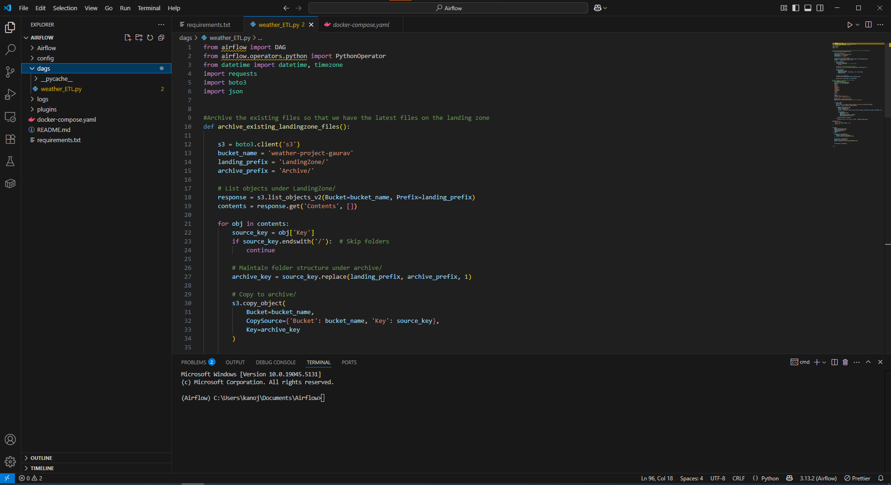

# Weather_Data_Pipeline_Airflow
Weather_Data_Pipeline_Airflow


- **Youtube**[Link](https://www.youtube.com/watch?v=GgicultChWs)





#Steps 
- create a Airflow folder
- Navigate to the airflow folder
- run below command to create a virtual environment
```
python -m venv Airflow

```
- Download the specific dependencies to virtual environment using PIP eg: pip install requests pandas numpy.
- Create a weather_ETL_DAG.py in DAG's folder.
- prerequisites is to donwload and install the docker and airflow container [link](https://github.com/kanojia-gaurav/Airflow_Setup)
- once the docker is running and the airflow containers are up we can see the dags created on the UI.
- Please follow my youtube link to understand better.

#prerequisites 
- Data Engineeer or software Engineer. 
